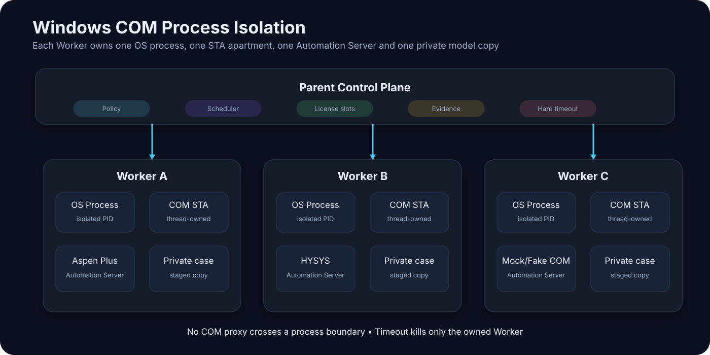
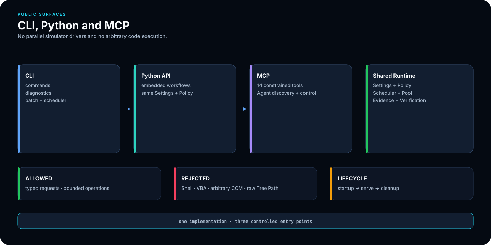
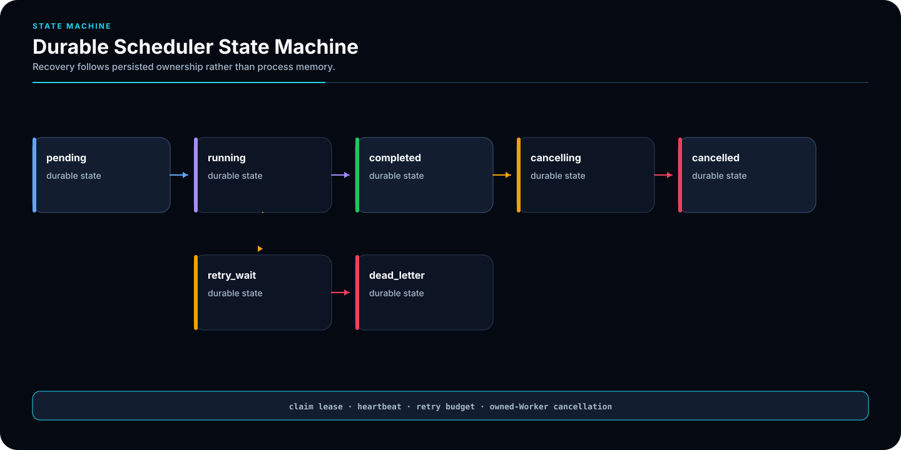
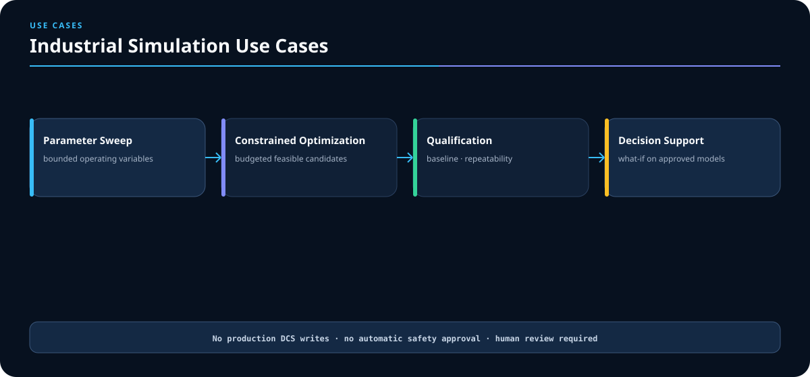
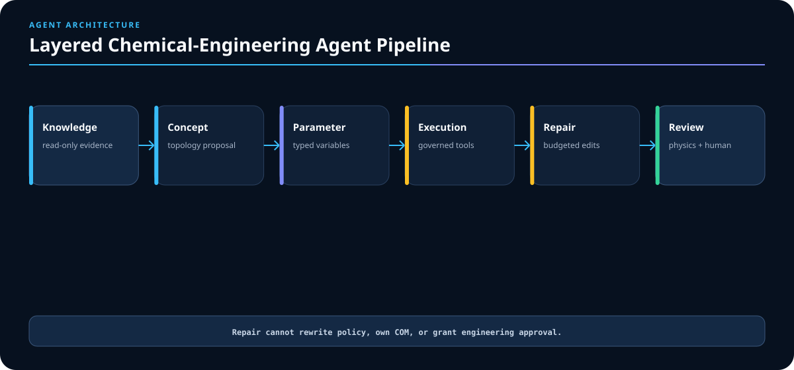
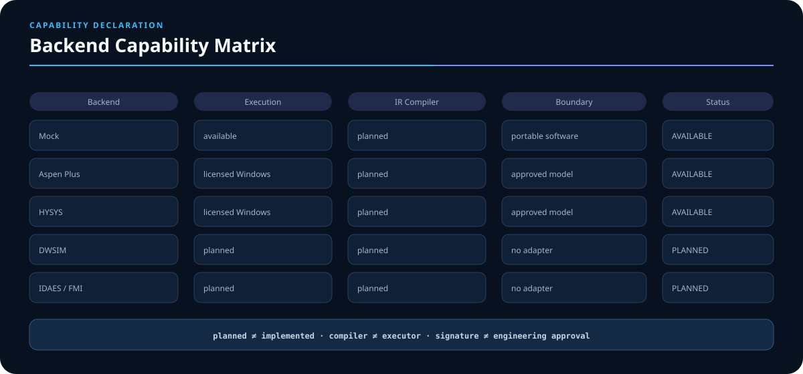
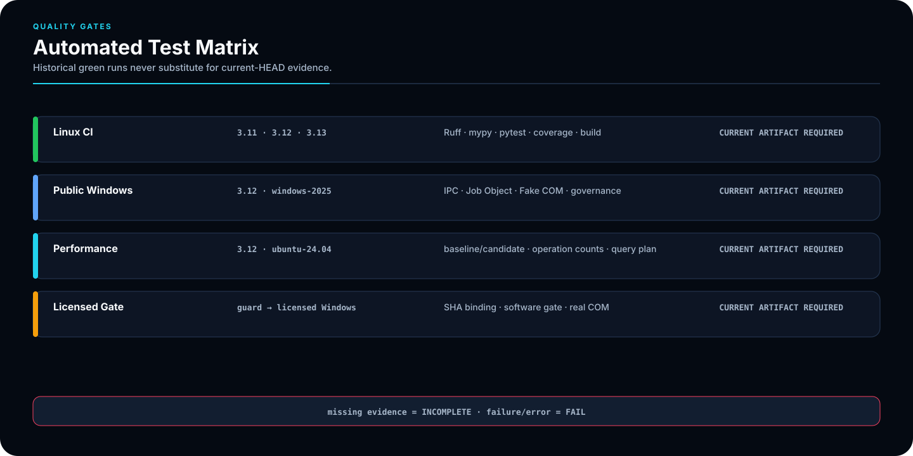
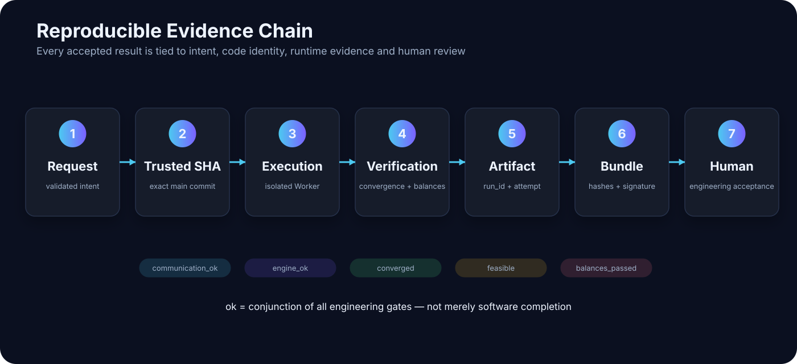
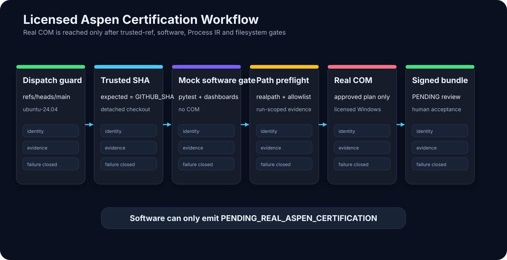
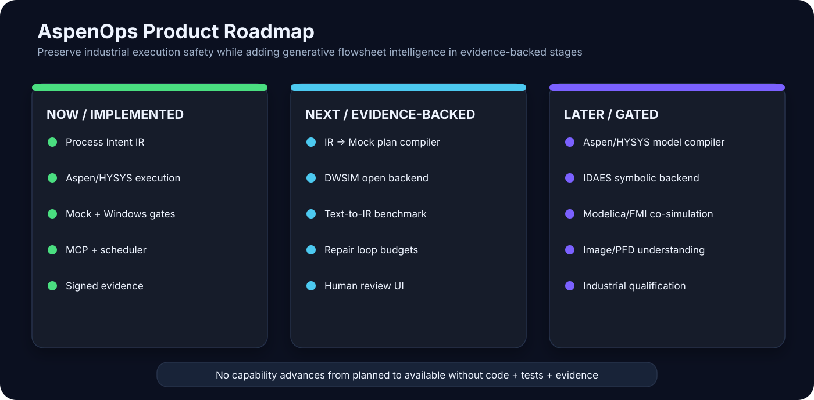

<div align="center">

# AspenOps 2.0

## Deterministic control plane for Aspen Plus, Aspen HYSYS and AI agents

**Agent / CLI / Python → validated process intent → isolated execution → nonlinear solve → engineering decision → reproducible evidence**

[中文](README.md) · [Architecture](docs/architecture.md) · [Process Intent IR](docs/process-intent-ir.md) · [Windows Setup](docs/windows-setup.md) · [Certification](docs/certification.md) · [Quality Report](docs/quality-report.md) · [Security](SECURITY.md) · [Contributing](CONTRIBUTING.md)

[](https://github.com/SUNHAOJUN22/AspenOps-Agent/actions/workflows/ci.yml?query=branch%3Amain+event%3Apush)
[](https://github.com/SUNHAOJUN22/AspenOps-Agent/actions/workflows/windows-control-plane.yml?query=branch%3Amain+event%3Apush)


</div>


> This README uses twelve original AI-generated SVG capability diagrams. They describe implemented contracts and explicitly labelled planned work; they never present software tests, Mock execution or signatures as licensed Aspen engineering certification.

---

## Authoritative status

| Item | Status |
|---|---|
| Default and only long-lived branch | `main` |
| Package | `aspenops-nexus 2.0.0` |
| Public matrix | Python 3.11, 3.12 and 3.13 |
| Archived validated baseline | Actions run `29814739487` |
| Archived Python 3.12 result | 72 test modules, 563 passed, 0 failed, 0 skipped, 16.73 s |
| Combined branch-aware coverage | 94.9719800747198% |
| Coverage floor | 94.5% |
| Archived public Windows run | Actions run `29814739334`, 104 passed, 2.06 s |
| MCP tools | 14 |
| Licensed Aspen status | `PENDING_REAL_ASPEN_CERTIFICATION` |

These figures come from inspected JUnit, coverage JSON and logs. They are an **archived validated baseline**, **not an automatic claim** about any later commit. The badges reflect current `main` push workflows; historical numbers never replace fresh Actions evidence for the current SHA.

Public CI validates the control plane, path policy, process isolation, scheduling, archives, interfaces, Process Intent and documentation contracts. It cannot qualify a commercial Aspen installation, licence, property method, reaction model or engineering case.

---

## Product position

AspenOps is not a wrapper that lets a model generate arbitrary COM scripts. Aspen Plus, Aspen HYSYS, CLI, Python and AI agents use one deterministic control plane:

- agents submit semantic variables or validated `aspenops.flowsheet/v1`;
- each real Automation Server lives in one Windows child process and one STA apartment;
- every Worker uses a private staged model copy;
- concurrency is bounded by licence slots, resources and lifecycle policy;
- communication, engine return, convergence, constraints, material/energy balances and human approval are separate gates;
- accepted results bind request, model, registry, code revision and evidence hashes;
- DWSIM, IDAES, Modelica/FMI and automatic flowsheet compilers remain `planned`; when no adapter exists, execution fails closed.

---

## Quick start

Requirements: Python 3.11–3.13 and `uv >= 0.11.16`.

```bash
git clone https://github.com/SUNHAOJUN22/AspenOps-Agent.git
cd AspenOps-Agent

uv lock --check
uv sync --frozen --extra dev --extra agent --extra signing

uv run aspenops --version
uv run aspenops demo
uv run aspenops dry-run examples/batch-request.example.json
```

Add `--extra windows` for a real Windows backend:

```powershell
uv sync --frozen --extra windows --extra dev --extra agent --extra signing
uv run aspenops doctor --probe
```

The first run defaults to Mock. Mock is cross-platform software validation, not Aspen Plus or HYSYS physics evidence.

---

## Configuration boundaries

The portable defaults come from `.env.example`:

```dotenv
ASPENOPS_BACKEND=mock
ASPENOPS_MODE=default
ASPENOPS_ALLOWED_ROOTS=
ASPENOPS_STATE_DIR=var/aspenops-state
ASPENOPS_LICENSE_SLOTS=1
ASPENOPS_MAX_WORKERS=1
ASPENOPS_MAX_RESIDENT_CASES=2
```

Real Aspen requires absolute allowed roots, and the state directory must stay inside an allowed root:

```dotenv
ASPENOPS_BACKEND=aspen_plus
ASPENOPS_ALLOWED_ROOTS=C:/AspenModels;C:/AspenResults
ASPENOPS_STATE_DIR=C:/AspenResults/aspenops-state
```

Rules:

1. Mock may use an empty allowlist; Aspen Plus and HYSYS may not.
2. `..`, symlinks, Windows junctions and realpath escapes are rejected.
3. `ASPENOPS_LICENSE_SLOTS` and `ASPENOPS_MAX_WORKERS` jointly cap concurrency.
4. Duplicate dotenv variables, unbalanced quotes and raw secret echoing are rejected.
5. Private keys, tokens, licence secrets, customer paths and production data never belong in the repository.

See [Windows Setup](docs/windows-setup.md).

---

## Industrial safety invariants



1. One COM object belongs to one Windows child process and one STA apartment.
2. Agents never construct arbitrary Aspen Tree Paths or run arbitrary Python, Shell or VBA.
3. Workers use private case copies; hard timeouts terminate only verified AspenOps-owned processes.
4. Cache identity binds runtime, backend, model, registry and physical request.
5. Failed writes roll back and tainted Workers are recycled.
6. Mock, Fake COM, public Windows tests and signatures cannot self-grant real engineering certification.

A result is `ok=true` only when:

```text
communication_ok
AND engine_ok
AND converged
AND feasible
AND balances_passed
```

---

## Process Intent IR


The simulator-neutral schema is:

```text
aspenops.flowsheet/v1
```

It represents components, property method, unit operations, input/output ports, streams, parameters and safe metadata. It provides deterministic ordering, canonical JSON, SHA-256 graph identity, topology validation, quantity budgets, recycle policy and rejection of `code`, `script`, `shell`, `python`, `vba`, `command` and raw Tree Paths.

```bash
uv run python scripts/validate_process_ir.py \
  examples/process-intent.example.json \
  --canonical-output var/ci/process-intent-canonical.json \
  --report-output var/ci/process-intent-report.json

uv run python scripts/render_process_ir_dashboard.py \
  --input var/ci/process-intent-report.json \
  --output-html var/ci/process-ir-dashboard.html \
  --output-svg var/ci/process-ir-dashboard.svg
```

`process-ir-dashboard.html` exposes issues, backend declarations and the agent pipeline. See [Process Intent IR](docs/process-intent-ir.md).

---

## CLI, Python and MCP



All three entry points reuse the same Settings, Policy, Scheduler, Worker and Evidence implementation.

| Surface | Primary use | Boundary |
|---|---|---|
| CLI | demo, diagnostics, batch, scheduling, optimization and verification | parameterized commands, no arbitrary code |
| Python | embedded batch, scheduler, optimization and evidence workflows | the same policy and data models |
| MCP | agent discovery, planning, submission, observation and verification | exactly 14 narrow tools, no arbitrary Shell/COM/Tree Path |

Primary commands:

```text
demo
doctor
dry-run
run-batch
submit
job
scheduler
benchmark
optimize
certify
certification-preflight
certify-licensed
verify-licensed-bundle
verify-bundle
mcp
```

---

## Common workflows

### 1. Validate before batch execution

```bash
uv run aspenops dry-run examples/batch-request.example.json

uv run aspenops run-batch examples/batch-request.example.json \
  --output var/aspenops-state/results.json \
  --bundle var/aspenops-state/run-bundle.zip
```

### 2. Run a durable background job

Terminal 1: start the long-lived scheduler service. It continuously leases queued work and stops cleanly on Ctrl+C.

```bash
uv run aspenops scheduler
```

Terminal 2: validate and enqueue a request, then query the same durable state database.

```bash
JOB_ID=$(
  uv run aspenops submit examples/batch-request.example.json |
  python -c 'import json,sys; print(json.load(sys.stdin)["job_id"])'
)
uv run aspenops job "$JOB_ID"
```

### 3. Run budgeted constrained optimization

```bash
uv run aspenops optimize examples/optimization-request.example.json \
  --output var/aspenops-state/optimization-result.json
```

### 4. Verify an evidence bundle

```bash
uv run aspenops verify-bundle var/aspenops-state/run-bundle.zip
```

### 5. Start the local MCP stdio server

```bash
uv run aspenops mcp
```

MCP exposes no `eval`, arbitrary filesystem, arbitrary Shell, VBA, unrestricted COM method or raw Tree Path write.

---

## Scheduling and recovery



`submit` validates and durably enqueues only; `scheduler` is the long-lived queue service; `job` reads state without creating Workers or a PoolManager. The scheduler uses SQLite WAL, idempotent submission, leases, heartbeats, cancellation deadlines and attempt limits:

```text
validate
→ persist QUEUED
→ claim lease
→ heartbeat RUNNING
→ isolated Worker
→ atomic COMPLETED / FAILED / CANCELLED
```

- after lease expiry or service restart, jobs with attempts remaining enter `retry_wait`; exhausted jobs enter `dead_letter`;
- jobs with a pending cancellation request recover as `cancelled`;
- cancellation terminates only an owned Worker;
- CasePool reuse is bound to backend, model, registry, concurrency and visibility identity;
- final state and evidence are committed atomically rather than treating `Run2` return as success.

---

## Industrial use cases



| Scenario | AspenOps capability | Retained human responsibility |
|---|---|---|
| Parameter study | bounded sweeps over semantic temperature, pressure, flow and ratio variables | approval of operating ranges |
| Constrained optimization | feasibility and Pareto evidence within evaluation budgets | equipment, control and safety review |
| Regression and qualification | baseline/candidate, repeatability and tolerance evidence | licensed runtime and physics qualification |
| Operational decision support | what-if analysis against an existing approved model | production DCS control and final process decisions |

AspenOps never writes directly to production DCS. It creates governed simulation evidence for qualified engineers.

---

## Layered process agents



```text
Knowledge
→ Concept
→ Parameter
→ Execution
→ Repair
→ Physics / Engineering Review
```

Knowledge is read-only. Concept and Parameter output only validated IR. Execution uses only declared available backends and narrow tools. Repair is bounded by iteration, time and solve budgets. Review independently checks physics, convergence, constraints, balances and human approval.

---

## Multi-simulator capability declaration



| Backend | Current execution | IR compiler | Boundary |
|---|---|---|---|
| Mock | available | planned | cross-platform software tests, no Aspen physics |
| Aspen Plus | available on licensed Windows | planned | existing approved-model execution |
| HYSYS | available on licensed Windows | planned | existing approved-model execution |
| DWSIM | planned | planned | **not implemented; no adapter** |
| IDAES | planned | planned | **not implemented; no adapter** |
| Modelica/FMI | planned | planned | **not implemented; no adapter** |

**planned != implemented; compiler != executor; a signature != engineering approval.**

---

## Automated tests and quality gates



The four authoritative workflows are:

| Workflow | Pinned environment | Responsibility |
|---|---|---|
| `ci.yml` | `ubuntu-24.04`; Python 3.11/3.12/3.13 | Ruff, format, strict mypy, six dependency audits, full tests, branch coverage, build, Wheel, Mock, MCP, Process Intent IR and dashboards |
| `windows-control-plane.yml` | `windows-2025`; Python 3.12 | Windows Job, IPC, Fake Aspen/HYSYS, PowerShell, paths, IR and governance |
| `generate-performance-evidence.yml` | `ubuntu-24.04`; Python 3.12 | trusted baseline/candidate, independent frozen environments and stable-regression evidence |
| `licensed-aspen-certification.yml` | `ubuntu-24.04` guard → licensed Windows | main guard, SHA binding, Mock/IR software gates, evidence isolation and real COM |

Frozen audits cover `Linux and Windows × Python 3.11, 3.12 and 3.13`: six targets. Hosted runners, third-party Actions and `uv 0.11.16` are pinned; workflow permission remains `contents: read`.

Complete local quality gate:

```bash
uv lock --check
uv sync --frozen --extra dev --extra agent --extra signing
uv run ruff check .
uv run ruff format --check .
uv run mypy src
uv run pytest -W error::ResourceWarning \
  --cov=aspenops_nexus \
  --cov-branch \
  --cov-fail-under=94.5
uv build
uv run python scripts/check_mcp.py
uv run python scripts/validate_process_ir.py examples/process-intent.example.json
uv run aspenops demo
```

Artifact names contain both `github.run_id` and `github.run_attempt`. Current-job evidence is written under `$RUNNER_TEMP`; uploads read through `${{ runner.temp }}` and use `if-no-files-found: error`. Missing JUnit or early termination renders `INCOMPLETE`; any failure/error renders `FAIL`.

---

## Reproducible evidence



```text
validated intent
→ exact trusted main SHA
→ isolated Worker execution
→ convergence / feasibility / balances
→ run_id + run_attempt artifact
→ hashes and optional signature
→ qualified human acceptance
```

Performance dispatch first checks `GITHUB_REF == refs/heads/main`. A non-main dispatch writes `dispatch-ref.txt` and `dispatch-guard.log`, then **fails explicitly with exit code 2** instead of becoming all-skipped. `actions/checkout` loads the trusted workflow revision; candidate and baseline pass `--end-of-options` and ancestry checks before validated detached checkout.

Default performance baseline:

```text
ebef32ee1f2be74df5d5c5489e7ca86d35ac7bb2
```

Mock performance is orchestration evidence, not licensed Aspen solve speed.

---

## Licensed Aspen certification



The protected workflow:

1. checks `refs/heads/main` in a fixed `ubuntu-24.04` guard;
2. requires `expected_head_sha == GITHUB_SHA`;
3. verifies the initial `actions/checkout` and then uses detached checkout;
4. creates `$RUNNER_TEMP/aspenops-licensed-artifact-<GITHUB_RUN_ID>-<GITHUB_RUN_ATTEMPT>` before checkout;
5. records run identity in `run-metadata.txt`;
6. stores Mock JUnit, dashboards, successful evidence copies and final `job_status` in that run directory;
7. uses `LICENSED_EVIDENCE_DIR=ASPENOPS_STATE_DIR/licensed-certification/<GITHUB_RUN_ID>-<GITHUB_RUN_ATTEMPT>`;
8. serializes real runs with concurrency group `licensed-aspen-certification`;
9. uploads only the current `${{ runner.temp }}` directory, includes `github.run_attempt`, and uses `if-no-files-found: error`.

Software can emit only:

```text
PENDING_REAL_ASPEN_CERTIFICATION
```

Real certification still requires licensed Windows, a valid licence, an approved model, signing material and qualified human engineering acceptance. The open certification gate is issue `#16`.

---

## Repository structure

```text
.github/workflows/       four authoritative automation workflows
docs/                    architecture, Windows, performance, certification and quality
docs/assets/readme/      twelve CI-governed README SVG assets
examples/                batch, optimization and Process Intent examples
scripts/                 validators, dashboards, benchmarks and Windows setup
src/aspenops_nexus/      control plane, backends, Workers, scheduler, optimization, evidence and MCP
tests/                   Linux, Windows, workflow, documentation and safety contracts
var/                     reproducible baselines, audit manifests and local state
```

---

## Troubleshooting

| Symptom | Check first | Required approach |
|---|---|---|
| `doctor --probe` is not ready | Python bitness, COM ProgID, licence and allowed roots | never bypass preflight or add a raw COM shortcut |
| path rejected | `ASPENOPS_ALLOWED_ROOTS` and realpath | place model, registry, state and outputs in approved absolute roots |
| batch returns `ok=false` | communication, engine, convergence, feasibility and balances | repair each gate; `Run2` return is not convergence |
| job remains `pending` | a long-lived `aspenops scheduler` service and matching state directory | start the scheduler; `submit` cannot continue after its process exits |
| job remains running | lease, heartbeat, Worker PID and cancellation deadline | let the scheduler reclaim leases; do not kill unknown Aspen processes |
| dashboard is `INCOMPLETE` | current-job JUnit and coverage | never reuse stale artifacts or convert missing evidence into PASS |
| README SVG does not render | filename case, XML, fonts and resource-safety test | use local, self-contained SVG with no embedded CJK text |
| licensed workflow does not run | ref, `expected_head_sha`, environment approval and runner labels | execute only on protected `main` and an approved licensed host |

---

## Roadmap



### Implemented

- Process Intent IR, strict validation, canonical JSON and SHA-256 graph identity;
- Aspen Plus/HYSYS existing-model control plane;
- Mock, Fake COM, Windows Job Object, durable scheduling, optimization and MCP;
- frozen CI, dashboards, evidence bundles and licensed-certification boundaries.

### Next

- IR → Mock non-executable plan compiler;
- open DWSIM process backend;
- Text/Image → IR benchmark and data contracts;
- bounded simulation-feedback Repair loops;
- human review and visual-diff UI.

### Evidence-gated later

- Aspen/HYSYS automatic flowsheet compiler;
- IDAES symbolic backend;
- Modelica/FMI co-simulation;
- PFD/sketch understanding;
- industrial model and version qualification.

No capability moves from planned to available without **code + tests + evidence**.

---

## AI-generated visual assets

The following twelve original, self-contained SVGs live in `docs/assets/readme/` and load no external image or font resource:

1. `hero-architecture.svg`
2. `process-intent-ir.svg`
3. `agent-pipeline.svg`
4. `backend-capabilities.svg`
5. `com-isolation.svg`
6. `cli-mcp-workflow.svg`
7. `scheduler-lifecycle.svg`
8. `industrial-scenarios.svg`
9. `test-matrix.svg`
10. `evidence-chain.svg`
11. `licensed-certification.svg`
12. `roadmap.svg`

`tests/test_readme_visual_assets.py` checks bilingual references, exact inventory, XML, size, path safety, accessibility, renderer portability, scripts, events, remote resources, Data URIs and workflow inclusion.

---

## Documentation, contribution and security

- [Architecture](docs/architecture.md)
- [Process Intent IR](docs/process-intent-ir.md)
- [External Agent Integration](docs/external-agent-integration.md)
- [Windows Setup](docs/windows-setup.md)
- [Performance](docs/performance.md)
- [Certification](docs/certification.md)
- [Test Audit](docs/automated-test-audit-2026-07-22.md)
- [Quality Report](docs/quality-report.md)
- [Contributing](CONTRIBUTING.md)
- [Security](SECURITY.md)

Automation does not prove that every Aspen version starts, every model converges, or that property methods, reactions, equipment and control assumptions are engineering-correct. The code is Apache-2.0. Never commit customer models, proprietary thermodynamics or kinetics, production DCS data, licences, private keys, tokens, internal hosts or commercial evidence bundles.
