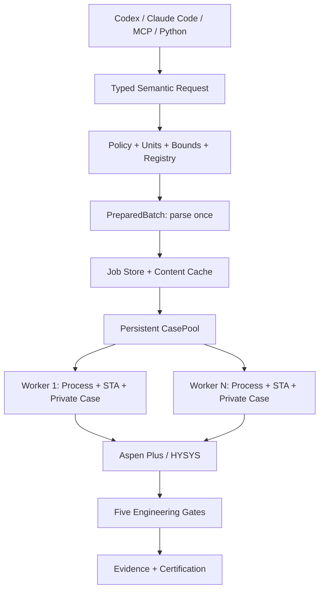
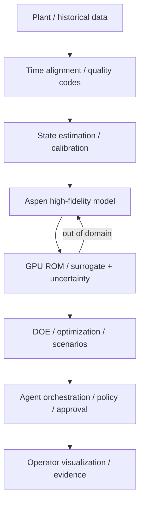

<div align="center">

# AspenOps 1.2

## A deterministic, high-throughput, verifiable execution control plane for Aspen

### Codex / Claude Code / MCP → semantic process intent → isolated execution → Aspen solve → engineering gates → reproducible evidence

**Not a GUI macro. Not a few `Tree.FindNode()` calls. Not unrestricted LLM access to COM.**  
**AspenOps turns a stateful, blocking, version-sensitive and license-constrained simulator into an engineering computation system with explicit semantics and evidence boundaries.**

[中文](README.md) | [English](README.en.md)

[](https://github.com/SUNHAOJUN22/AspenOps-Agent/actions/workflows/ci.yml)


</div>

---

## Qualification status

| Level | Status | Evidence |
|---|---:|---|
| Ruff, formatting, strict typing | **PASS** | Ruff and strict mypy across 32 source modules |
| Automated tests | **PASS** | **78 passed, 1 skipped**; the skipped test is licensed Windows Aspen only |
| Coverage | **PASS** | **85%** total with branch coverage enabled |
| Multiprocess Mock execution | **PASS** | Real spawn workers, IPC, cache, scheduling, evidence and jobs |
| Fake COM contracts | **PASS** | Transactional writes, rollback, strict state parsing, convergence and injected failures |
| Wheel / sdist / clean install | **PASS** | Version, doctor, demo and benchmark from a fresh wheel environment |
| Windows COM activation | **BLOCKED** | This build node is not a Windows Aspen workstation |
| Real model solve | **BLOCKED** | No license seat and approved non-confidential qualification model supplied |
| Physical certification | **BLOCKED** | No three-run fresh-instance convergence, constraints and balance evidence yet |

> Mock passing is not Aspen passing. COM activation is not model qualification. `Run2()` returning is not convergence, and convergence alone is not physical validity.

---

## Definition

> **The agent decides what to investigate, Aspen solves the thermodynamics and process equations, and AspenOps determines whether the operation is allowed, dimensionally valid, converged, feasible, conservative and reproducible.**

```text
Typed Request
  → Policy / Units / Bounds / Semantic Registry
  → PreparedBatch / Content Identity / Cache / Job Store
  → Persistent Process-isolated CasePool
  → Aspen Plus or HYSYS Solver
  → Transport / Engine / Convergence / Constraints / Balances
  → Immutable Evidence Bundle
```

Aspen Plus and Aspen HYSYS remain the high-fidelity process simulators. AspenOps is the deterministic boundary between them and AI agents.

---

## What changed in 1.2

- Omitted `backend` inherits deployment configuration instead of silently selecting Mock.
- A batch is parsed, authorized and prepared once rather than repeated between dry-run and execution.
- Runtime booleans are strict; strings such as `"false"` cannot become truthy simulator evidence.
- Simulator request rejection is separated from worker transport failure, avoiding pointless restarts.
- Only workers required by unique cache misses are activated.
- Large SQLite cache lookups are chunked below the bind-variable limit.
- Recent-job listing is one query rather than an N+1 read pattern.
- Output reads stop when the engine did not return, preserving the real root cause.
- Conservation scaling floors must be strictly positive.
- The worker protocol is version 3 and all public schemas are v1.2.

### Sparse-load result

With `workers=16` and one unique Mock point on the same host:

| Version | Workers actually started | Total time |
|---|---:|---:|
| 1.1 | 16 | 2.180 s |
| 1.2 | 1 | 0.166 s |

That is a 93.75% reduction in simulator instances and about a 92.4% reduction in elapsed time. The impact is especially relevant on licensed Aspen hosts.

---

## Architecture and invariants



```text
one worker
= one OS child process
= one COM STA apartment
= one private model copy
= one simulator document
= one sequential command stream
```

COM proxies never cross thread, process, Queue, Pipe or JSON boundaries.

---

## Five validity gates

\[
S_{valid}=S_{transport}\land S_{engine}\land S_{convergence}
\land S_{constraints}\land S_{balances}
\]

`ok=true` requires all five gates. Conservation uses both absolute and normalized residuals:

\[
r_b=\sum_i a_iq_i-q_{expected},\qquad
\varepsilon_{rel}=\frac{|r_b|}{\max(\sum_i|a_iq_i|,q_{floor})}
\]

The evidence stores every term, coefficient, unit, signed contribution, scale, residual and tolerance.

---

## Version-adaptive Aspen integration

AspenOps does not maintain a fragile marketing-version table. A Windows worker:

1. honors an explicitly pinned ProgID;
2. scans 64-bit and 32-bit registry views;
3. enumerates `Apwn.Document.*` and `HYSYS.Application.*`;
4. tries numeric versions newest first with `DispatchEx`;
5. retains the unversioned ProgID as a fallback;
6. records the actual ProgID and exposed application version in runtime identity and evidence.

Qualification levels remain distinct:

```text
Discovered → Instantiated → Model opened → Converged → Physically certified
```

---

## Aspen Plus and HYSYS

Aspen Plus uses private case copies, validated and cached tree nodes, read-before-write, read-after-write verification, rollback on partial failure, and explicit convergence evidence. `Engine.Running == False` is never treated as convergence by itself.

HYSYS defaults to an engineer-owned Spreadsheet Contract:

```text
Semantic Key → Registry → Spreadsheet + Cell → HYSYS internal binding
```

A project-validated Spreadsheet convergence signal is mandatory because solver idle is not a universal convergence indication.

---

## Performance model

\[
T_{pool}\approx W(T_{start}+T_{open})+
\frac{N_{unique}}{W}(T_{write}+T_{solve}+T_{read})+T_{IPC}
\]

\[
W_{effective}=\min(W_{configured},W_{license},W_{memory},W_{stable},N_{miss})
\]

48 unique Mock points, five rounds per configuration:

| Workers | 1.1 | 1.2 | Change |
|---:|---:|---:|---:|
| 1 | 32.58 points/s | 33.08 points/s | +1.53% |
| 2 | 51.49 points/s | 50.73 points/s | -1.48% |
| 4 | 55.54 points/s | 54.20 points/s | -2.41% |

The saturated-batch differences are small: one worker improved slightly while two and four workers regressed slightly. AspenOps 1.2 therefore makes no universal throughput claim; its deterministic benefit is eliminating unnecessary instances, retries and license consumption.

These values measure the portable control plane, not the real Aspen solver and not CUDA acceleration. Real concurrency must be qualified against the target model, memory and license limits.

---

## NVIDIA-style layered digital twin



GPUs are appropriate for ROMs, surrogates, Bayesian optimization, uncertainty propagation and analytics. Aspen remains the high-fidelity physics model. AspenOps makes no claim that CUDA directly accelerates COM `Run2()`. Omniverse, when used, is an optional USD visualization adapter—not a thermodynamic solver and not a Core dependency.

---

## Installation

```bash
uv sync --extra dev --extra agent --extra report
uv run aspenops version
uv run aspenops doctor
uv run aspenops demo
```

Windows Aspen workstation:

```powershell
uv sync --extra windows --extra agent --extra dev --extra report
$env:ASPENOPS_BACKEND = "aspen_plus"
$env:ASPENOPS_ALLOWED_ROOTS = "D:/AspenModels;D:/AspenResults"
$env:ASPENOPS_LICENSE_SLOTS = "1"
uv run aspenops doctor --probe
```

Never commit licenses, proprietary cases, credentials, customer data or private kinetics.

---

## Codex, Claude Code and MCP

The repository includes `.codex/config.toml`, `.mcp.json`, `AGENTS.md` and `CLAUDE.md`.

Recommended sequence:

```text
system_info → list_semantic_variables → dry_run_request
→ submit_batch / run_batch_sync → job_status → job_result
→ verify_evidence_bundle
```

The ten MCP tools are narrow and typed. There is no arbitrary shell, Python, VBA, generic COM reflection, unrestricted tree mutation or machine-wide process kill capability.

---

## Release gate

```bash
uv run ruff check .
uv run ruff format --check .
uv run mypy src
uv run pytest -W error::ResourceWarning \
  --cov=aspenops --cov-branch --cov-fail-under=85
uv run python scripts/check_release_consistency.py
uv run python scripts/check_mcp.py
uv build --clear
uv run python scripts/release_gate.py
```

Real physical qualification belongs on the licensed self-hosted Windows workflow and must record the actual ProgID, exposed Aspen version, case and registry hashes, three fresh-instance solves, convergence, constraints and balances.

---

## Boundaries and security

- Public CI validates the control plane, not licensed Aspen physics.
- Registry discovery is not a release-specific certification.
- Semantic paths must be validated against the real case.
- Warm-start is path dependent and not generally parallelizable.
- Mock performance must not drive license procurement or production capacity planning.
- Models are read-only masters; workers use private copies.
- Timeouts clean only descendants created by the current worker.
- Evidence binds request, model, registry, runtime and result hashes.

See [SECURITY.md](SECURITY.md), [Architecture](docs/architecture.md), [Performance](docs/performance.md), [Certification](docs/certification.md) and [Windows Setup](docs/windows-setup.md).

Apache-2.0. Citation metadata is in [CITATION.cff](CITATION.cff). Aspen Plus, Aspen HYSYS, NVIDIA and Omniverse are trademarks of their respective owners; this repository contains no vendor software, license or proprietary model.
