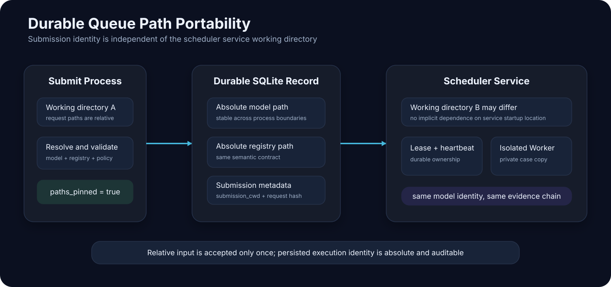

<div align="center">

# AspenOps 2.0

## Deterministic control plane for Aspen Plus, Aspen HYSYS and AI agents

**Agent / CLI / Python → validated process intent → isolated execution → nonlinear solve → engineering decision → reproducible evidence**

[中文](README.md) · [Architecture](docs/architecture.md) · [Process Intent IR](docs/process-intent-ir.md) · [Windows Setup](docs/windows-setup.md) · [Performance](docs/performance.md) · [Certification](docs/certification.md) · [Quality Report](docs/quality-report.md) · [Security](SECURITY.md) · [Contributing](CONTRIBUTING.md)

[](https://github.com/SUNHAOJUN22/AspenOps-Agent/actions/workflows/ci.yml?query=branch%3Amain+event%3Apush)
[](https://github.com/SUNHAOJUN22/AspenOps-Agent/actions/workflows/windows-control-plane.yml?query=branch%3Amain+event%3Apush)


</div>


> This README uses fourteen original AI-generated SVG capability diagrams. They represent implemented contracts and explicitly labelled planned work; Mock, Fake COM, software tests, signatures and compatibility checks are never presented as licensed Aspen engineering certification.

---

## Authoritative status

| Item | Status |
|---|---|
| Default and only long-lived branch | `main` |
| Package | `aspenops-nexus 2.0.0` |
| Public test matrix | Python 3.11, 3.12 and 3.13 |
| Archived validated baseline | Actions run `29814739487` |
| Archived Python 3.12 result | 72 test modules, 563 passed, 0 failed, 0 skipped, 16.73 s |
| Combined branch-aware coverage | 94.9719800747198% |
| Coverage floor | 94.5% |
| Archived public Windows gate | Actions run `29814739334`, 104 passed, 2.06 s |
| MCP tools | 14 |
| Frozen MCP SDK | `1.28.1`; non-frozen installs require `mcp>=1.9,<2` |
| Licensed Aspen status | `PENDING_REAL_ASPEN_CERTIFICATION` |

These figures come from inspected JUnit, coverage JSON and logs. They are **not an automatic claim** about any later commit. The badges reflect current `main` push workflows; historical numbers never replace fresh Actions evidence.

Public CI can validate the control plane, path policy, process isolation, scheduler, archives, interfaces, Process Intent, MCP compatibility and documentation contracts. It cannot certify a commercial Aspen installation, licence, property method, reaction model or engineering model.

---

## Product position

AspenOps is not a wrapper that lets a model emit arbitrary COM scripts. It connects Aspen Plus, Aspen HYSYS, CLI, Python and AI agents to one deterministic control plane:

- agents submit semantic variables or validated `aspenops.flowsheet/v1`;
- each real Automation Server belongs to an isolated Windows child process and STA apartment;
- every Worker uses a private model copy;
- concurrency is bounded by licence slots, resource budgets and lifecycle policy;
- communication, engine return, convergence, constraints, balances and human approval remain independent gates;
- accepted results bind request, model, registry, commit and evidence hashes;
- DWSIM, IDAES, Modelica/FMI and automatic flowsheet compilers remain `planned`; when unavailable, there is no adapter and execution fails closed.

---

## Quick start

Requirements: Python 3.11–3.13 and `uv >= 0.11.16`.

```bash
git clone https://github.com/SUNHAOJUN22/AspenOps-Agent.git
cd AspenOps-Agent

uv lock --check
uv sync --frozen --extra dev --extra agent --extra signing

uv run aspenops --version
uv run aspenops demo
uv run aspenops dry-run examples/batch-request.example.json
```

Add `--extra windows` for real Windows backends:

```powershell
uv sync --frozen --extra windows --extra dev --extra agent --extra signing
uv run aspenops doctor --probe
```

The first run defaults to Mock. Mock is portable software evidence, not Aspen Plus/HYSYS physical evidence.

For non-frozen Wheel installation outside the repository, constrain the MCP Python SDK to the supported 1.x line:

```bash
python -m pip install "aspenops-nexus[agent]" "mcp>=1.9,<2"
```

---

## Configuration boundaries

Portable defaults come from `.env.example`:

```dotenv
ASPENOPS_BACKEND=mock
ASPENOPS_MODE=default
ASPENOPS_ALLOWED_ROOTS=
ASPENOPS_STATE_DIR=var/aspenops-state
ASPENOPS_LICENSE_SLOTS=1
ASPENOPS_MAX_WORKERS=1
ASPENOPS_MAX_RESIDENT_CASES=2
```

Real Aspen requires absolute allowed roots and a state directory inside them:

```dotenv
ASPENOPS_BACKEND=aspen_plus
ASPENOPS_ALLOWED_ROOTS=C:/AspenModels;C:/AspenResults
ASPENOPS_STATE_DIR=C:/AspenResults/aspenops-state
```

Rules:

1. Mock may use an empty allowlist; real Aspen/HYSYS may not.
2. `..`, symlinks, Windows junctions and realpath escapes are rejected.
3. `ASPENOPS_LICENSE_SLOTS` and `ASPENOPS_MAX_WORKERS` jointly bound concurrency.
4. Duplicate `.env` variables, unbalanced quotes and potential secret echoing are rejected.
5. Private keys, tokens, licence secrets, customer model paths and production data do not belong in the repository.

See [Windows Setup](docs/windows-setup.md).

---

## Industrial safety invariants


1. One COM object belongs to one Windows child process and one STA apartment.
2. Agents cannot construct arbitrary Aspen Tree Paths or execute arbitrary Python, Shell or VBA.
3. Workers use private model copies; hard timeout kills only an AspenOps-owned process.
4. Cache identity binds runtime, backend, model, registry and physical request.
5. Failed writes roll back; tainted Workers are recycled.
6. Mock, Fake COM, public Windows tests and signatures cannot self-grant engineering certification.

A result is `ok=true` only when all gates pass:

```text
communication_ok
AND engine_ok
AND converged
AND feasible
AND balances_passed
```

---

## Process Intent IR


The simulator-neutral representation is:

```text
aspenops.flowsheet/v1
```

It models components, property methods, equipment, ports, streams, parameters and safe metadata. It provides deterministic ordering, canonical JSON, SHA-256 graph identity, connection checks, cycle policy, quantity budgets, and rejection of `code`, `script`, `shell`, `python`, `vba`, `command` and raw Tree Paths.

```bash
uv run python scripts/validate_process_ir.py \
  examples/process-intent.example.json \
  --canonical-output var/ci/process-intent-canonical.json \
  --report-output var/ci/process-intent-report.json

uv run python scripts/render_process_ir_dashboard.py \
  --input var/ci/process-intent-report.json \
  --output-html var/ci/process-ir-dashboard.html \
  --output-svg var/ci/process-ir-dashboard.svg
```

`process-ir-dashboard.html` exposes issues, backend capabilities and the agent pipeline. DWSIM, IDAES, Modelica and Aspen/HYSYS automatic flowsheet compilers remain planned; there is currently **no adapter** for those unimplemented routes.

---

## CLI, Python and MCP


All three surfaces reuse the same Settings, Policy, Scheduler, Worker and Evidence implementation.

| Surface | Primary use | Boundary |
|---|---|---|
| CLI | demo, diagnosis, batch, scheduling, optimization and evidence | parameterized commands, no arbitrary code |
| Python | embed batch, scheduling, optimization and evidence | same policies and data models |
| MCP | agent discovery, planning, submission, observation and verification | exactly 14 narrow tools, no arbitrary Shell/COM/Tree Path |

Commands:

```text
demo
doctor
dry-run
run-batch
submit
job
cancel
scheduler
benchmark
optimize
certify
certification-preflight
certify-licensed
verify-licensed-bundle
verify-bundle
mcp
```

---

## MCP compatibility and server lifecycle


AspenOps 2.0 currently targets the MCP Python SDK 1.x API. The frozen repository environment locks `mcp 1.28.1`; a non-frozen installation must use:

```text
mcp>=1.9,<2
```

Before importing `FastMCP`, the runtime reads the installed distribution version:

- missing MCP produces an explicit frozen `agent` extra installation message;
- major version 1 proceeds;
- any other major version or an unparseable version fails closed;
- an incompatible import is never presented as a working server.

The Scheduler is no longer started without a shutdown boundary after `build_server()`. FastMCP lifespan owns:

```text
server startup → scheduler.start()
serve 14 constrained tools
server shutdown → scheduler.stop() → Worker / PoolManager cleanup
```

This lifecycle proves software resource governance only; it does not certify a real Aspen model.

---

## Common workflows

### 1. Validate, then run a batch

```bash
uv run aspenops dry-run examples/batch-request.example.json

uv run aspenops run-batch examples/batch-request.example.json \
  --output var/aspenops-state/results.json \
  --bundle var/aspenops-state/run-bundle.zip
```

### 2. Run a durable background job

Terminal 1 starts the long-lived scheduler service:

```bash
uv run aspenops scheduler
```

Terminal 2 validates, enqueues and reads the same durable state database:

```bash
JOB_ID=$(
  uv run aspenops submit examples/batch-request.example.json |
  python -c 'import json,sys; print(json.load(sys.stdin)["job_id"])'
)
uv run aspenops job "$JOB_ID"
```

Request cancellation when needed:

```bash
uv run aspenops cancel "$JOB_ID" --grace-s 2
```

### 3. Run budgeted constrained optimization

```bash
uv run aspenops optimize examples/optimization-request.example.json \
  --output var/aspenops-state/optimization-result.json
```

### 4. Verify an evidence bundle

```bash
uv run aspenops verify-bundle var/aspenops-state/run-bundle.zip
```

### 5. Start the local MCP stdio server

```bash
uv run aspenops mcp
```

---

## Cross-process path pinning



Before a request crosses a process boundary, CLI and MCP durable submission perform:

```text
submission working directory
→ resolve model_path and registry_path
→ pin absolute paths
→ persist SQLite record
→ allow scheduler startup from any working directory
```

The CLI submission response explicitly records:

```text
paths_pinned = true
submission_cwd = <absolute submission directory>
```

This preserves the original convention—relative paths are interpreted from the submission call working directory—while preventing a long-lived scheduler launched elsewhere from changing model identity. Real backends still reapply allowed-root and realpath policy. Direct low-level Python calls to `BackgroundScheduler.submit()` should use absolute paths or first call `pin_durable_request_paths()`.

---

## Scheduling and recovery


`submit` validates and persists; `scheduler` is the long-lived service; `job` reads state; `cancel` sets cancellation and owned-Worker termination deadlines.

```text
validate
→ persist pending
→ claim lease
→ heartbeat running
→ isolated Worker
→ atomic completed / failed / cancelled
```

- expired leases or service restart move work with remaining attempts to `retry_wait`;
- work after its final attempt becomes `dead_letter`;
- cancellation requested during recovery becomes `cancelled`;
- cancellation can terminate only an owned Worker;
- evidence and terminal state are committed atomically.

---

## Industrial use cases


| Use case | AspenOps provides | It does not replace |
|---|---|---|
| Parameter sweep | bounded semantic temperature, pressure, flow and reflux scans | engineer-approved operating ranges |
| Constrained optimization | feasibility and Pareto evidence under a solve budget | equipment, control and safety review |
| Regression qualification | baseline/candidate, repeatability and tolerance evidence | a real Aspen licence and physical certification |
| Decision support | what-if studies on approved models | production DCS automatic control or closed-loop writes |

AspenOps does not write directly to production DCS. It produces governed simulation evidence for qualified engineers.

---

## Layered process agents


```text
Knowledge
→ Concept
→ Parameter
→ Execution
→ Repair
→ Physics / Engineering Review
```

Knowledge is read-only. Concept and Parameter may output validated IR only. Execution uses declared available backends. Repair is bounded by iteration, time and solve budgets. Review independently checks physics, convergence, constraints, balances and human approval.

---

## Multi-simulator capability declaration


| Backend | Current execution | IR compiler | Current boundary |
|---|---|---|---|
| Mock | available | planned | portable software evidence, no Aspen physics |
| Aspen Plus | available on licensed Windows | planned | existing approved-model execution |
| HYSYS | available on licensed Windows | planned | existing approved-model execution |
| DWSIM | planned | planned | **not implemented; no adapter** |
| IDAES | planned | planned | **not implemented; no adapter** |
| Modelica/FMI | planned | planned | **not implemented; no adapter** |

**planned ≠ implemented; compiler ≠ executor; signature ≠ engineering approval.**

---

## Automated tests and quality gates


The four authoritative workflows are:

| Workflow | Pinned environment | Responsibility |
|---|---|---|
| `ci.yml` | `ubuntu-24.04`; Python 3.11/3.12/3.13 | Ruff, format, strict mypy, six dependency audits, full tests, branch coverage, build, Wheel, Mock, MCP, IR and durable-queue smoke |
| `windows-control-plane.yml` | `windows-2025`; Python 3.12 | Windows Job, IPC, Fake Aspen/HYSYS, PowerShell, paths, IR and governance |
| `generate-performance-evidence.yml` | `ubuntu-24.04`; Python 3.12 | trusted baseline/candidate, two frozen environments and stable-regression evidence |
| `licensed-aspen-certification.yml` | `ubuntu-24.04` guard → licensed Windows | main guard, SHA binding, Mock/IR software gates, evidence isolation and real COM |

Frozen audits cover Linux and Windows × Python 3.11, 3.12 and 3.13: six audit targets. Hosted runners, third-party Actions and `uv 0.11.16` are pinned; workflow permission is `contents: read`.

```bash
uv lock --check
uv sync --frozen --extra dev --extra agent --extra signing
uv run ruff check .
uv run ruff format --check .
uv run mypy src
uv run pytest -W error::ResourceWarning \
  --cov=aspenops_nexus \
  --cov-branch \
  --cov-fail-under=94.5
uv build
uv run python scripts/check_mcp.py
uv run python scripts/validate_process_ir.py examples/process-intent.example.json
uv run aspenops demo
```

Artifact names contain both `github.run_id` and `github.run_attempt`. Current-job evidence is written to `$RUNNER_TEMP`, uploaded through `${{ runner.temp }}`, and uses `if-no-files-found: error`. Missing JUnit or early failure renders `INCOMPLETE`; any failure/error renders `FAIL`.

---

## Reproducible evidence


```text
validated intent
→ exact trusted main SHA
→ isolated Worker execution
→ convergence / feasibility / balances
→ run_id + run_attempt artifact
→ hashes and optional signature
→ qualified human acceptance
```

Performance dispatch first verifies `GITHUB_REF == refs/heads/main`. A non-main dispatch writes `dispatch-ref.txt` and `dispatch-guard.log`, then **fails explicitly with exit code 2** rather than becoming all-skipped. `actions/checkout` loads the trusted workflow revision; candidate and baseline pass `--end-of-options` and ancestry checks before validated detached checkout.

Default performance baseline:

```text
ebef32ee1f2be74df5d5c5489e7ca86d35ac7bb2
```

Mock performance is orchestration evidence, not licensed Aspen solve speed.

---

## Licensed Aspen certification


The protected workflow:

1. validates `refs/heads/main` in a fixed `ubuntu-24.04` guard;
2. requires `expected_head_sha == GITHUB_SHA`;
3. verifies the initial `actions/checkout` and then uses detached checkout;
4. creates `$RUNNER_TEMP/aspenops-licensed-artifact-<GITHUB_RUN_ID>-<GITHUB_RUN_ATTEMPT>` before checkout;
5. records identity in `run-metadata.txt`;
6. stores Mock JUnit, dashboards, evidence copies and final `job_status` in runner temp;
7. uses `LICENSED_EVIDENCE_DIR=ASPENOPS_STATE_DIR/licensed-certification/<GITHUB_RUN_ID>-<GITHUB_RUN_ATTEMPT>`;
8. serializes real runs with concurrency group `licensed-aspen-certification`;
9. uploads only the current `${{ runner.temp }}` directory, includes `github.run_attempt`, and uses `if-no-files-found: error`.

Software can emit only:

```text
PENDING_REAL_ASPEN_CERTIFICATION
```

Real certification still requires licensed Windows, a valid licence, an approved model, signing material and qualified human engineering acceptance.

---

## Repository structure

```text
.github/workflows/       four authoritative workflows
docs/                    architecture, Windows, performance, certification and quality
docs/assets/readme/      fourteen governed README SVGs
examples/                batch, optimization and Process Intent examples
scripts/                 validators, dashboards, benchmarks and Windows setup
src/aspenops_nexus/      control plane, backends, Workers, scheduler, optimization, evidence and MCP
tests/                   Linux, Windows, workflow, documentation and security contracts
var/                     reproducible baselines, audit manifests and local state
```

---

## Troubleshooting

| Symptom | Check first | Principle |
|---|---|---|
| `doctor --probe` is not ready | Python bitness, COM ProgID, licence and allowed roots | do not bypass preflight or hard-code raw COM |
| A path is rejected | `ASPENOPS_ALLOWED_ROOTS` and realpath | keep model, registry, state and output inside approved absolute roots |
| Submit succeeds but scheduler starts elsewhere | `paths_pinned` and `submission_cwd` | resubmit with the current version; persisted model and registry paths must be absolute |
| MCP startup reports an incompatible SDK major | `python -m pip show mcp` | install `mcp>=1.9,<2`; do not bypass the version gate |
| Workers remain after MCP shutdown | lifespan, Scheduler stop and current process ownership | use the current version; shutdown must call `scheduler.stop()` |
| Batch returns `ok=false` | communication, engine, converged, feasible and balances | repair each gate separately; Run2 return is not convergence |
| A job remains `pending` | whether `aspenops scheduler` is running | submit does not keep running after its process exits |
| A job remains running | lease, heartbeat, Worker PID and cancellation deadline | let the scheduler recover the owned Worker |
| Dashboard is `INCOMPLETE` | current job JUnit/coverage generation | do not reuse stale evidence or treat missing evidence as PASS |
| README SVG does not render | case, XML, font and resource-safety contracts | use repository-local, self-contained SVG without embedded CJK text |
| Licensed workflow does not run | ref, `expected_head_sha`, environment approval and runner labels | run only on protected `main` and a licensed host |

---

## Roadmap


### Implemented

- Process Intent IR, strict validation, canonical JSON and SHA-256 graph identity;
- Aspen Plus/HYSYS existing-model control plane;
- Mock, Fake COM, Windows Job Object, durable scheduling, cancellation, optimization and MCP;
- MCP 1.x fail-closed compatibility gate and FastMCP lifecycle cleanup;
- frozen CI, dashboards, evidence bundles and licensed-certification boundaries.

### Next

- IR → Mock non-executable plan compiler;
- open DWSIM backend;
- Text/Image → IR benchmark and data contracts;
- bounded simulation-feedback repair loops;
- human review and visual-diff UI.

### Evidence-gated later work

- Aspen/HYSYS automatic flowsheet compiler;
- IDAES symbolic backend;
- Modelica/FMI co-simulation;
- PFD/sketch understanding;
- industrial model and version qualification.

No capability moves from planned to available without **code + tests + evidence**.

---

## AI-generated visual assets

The fourteen original, self-contained SVGs under `docs/assets/readme/` are:

1. `hero-architecture.svg`
2. `process-intent-ir.svg`
3. `agent-pipeline.svg`
4. `backend-capabilities.svg`
5. `com-isolation.svg`
6. `cli-mcp-workflow.svg`
7. `mcp-runtime-lifecycle.svg`
8. `durable-path-portability.svg`
9. `scheduler-lifecycle.svg`
10. `industrial-scenarios.svg`
11. `test-matrix.svg`
12. `evidence-chain.svg`
13. `licensed-certification.svg`
14. `roadmap.svg`

`tests/test_readme_visual_assets.py` checks bilingual references, exact inventory, XML, size, path confinement, accessibility, renderer portability, scripts, events, remote resources, Data URIs and all three software gates.

---

## Documentation, contribution and security boundary

- [Architecture](docs/architecture.md)
- [Process Intent IR](docs/process-intent-ir.md)
- [External Agent Integration](docs/external-agent-integration.md)
- [Windows Setup](docs/windows-setup.md)
- [Performance](docs/performance.md)
- [Certification](docs/certification.md)
- [Test Audit](docs/automated-test-audit-2026-07-22.md)
- [Quality Report](docs/quality-report.md)
- [Contributing](CONTRIBUTING.md)
- [Security](SECURITY.md)

Automation does not prove every Aspen version starts, every model converges, or that property, reaction, equipment or control assumptions are engineering-correct. The code is Apache-2.0. Never commit customer models, proprietary thermodynamics or kinetics, production DCS data, licences, private keys, tokens, internal hosts or commercial evidence bundles.
