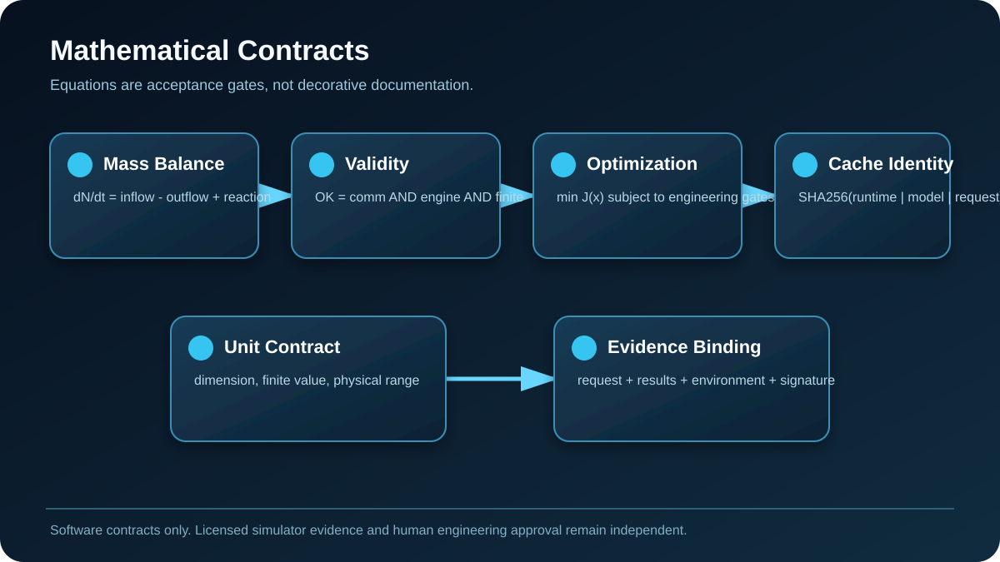
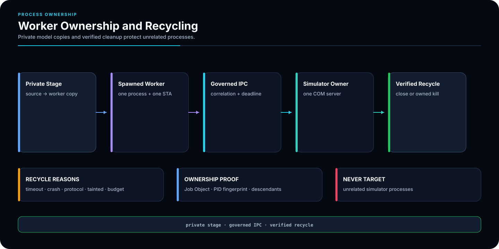
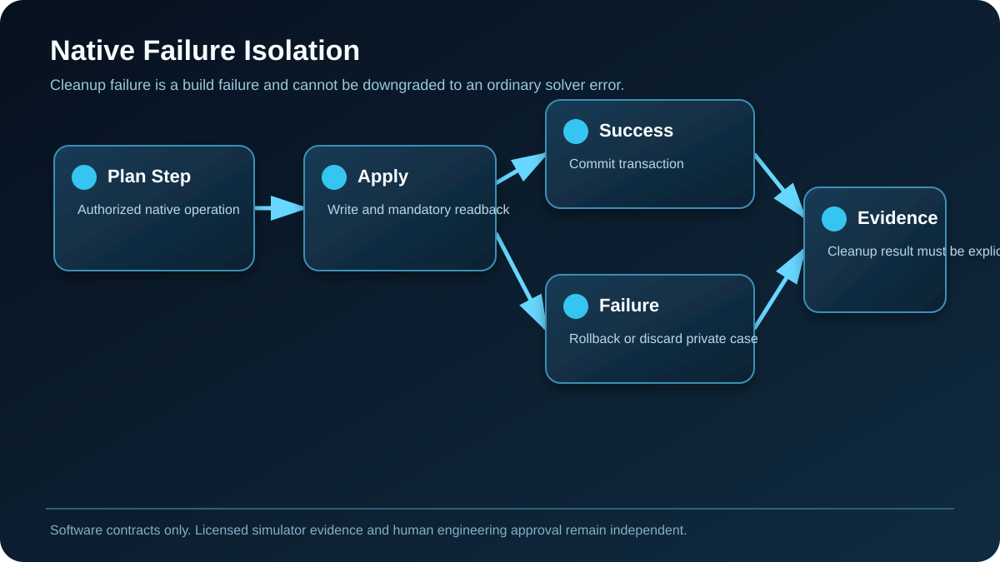
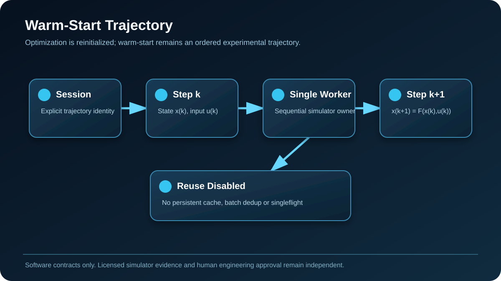
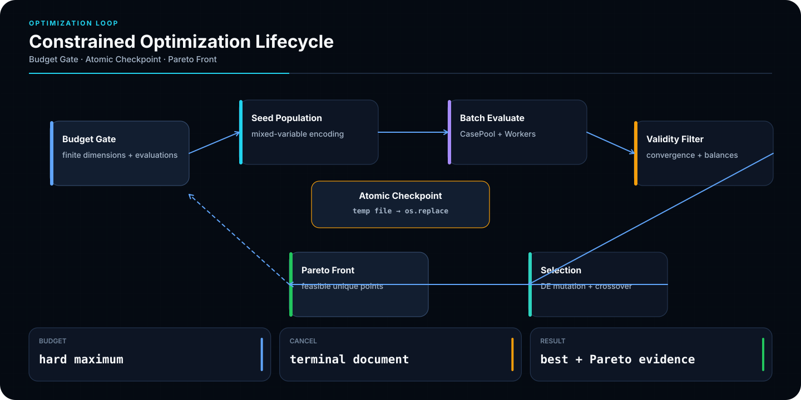
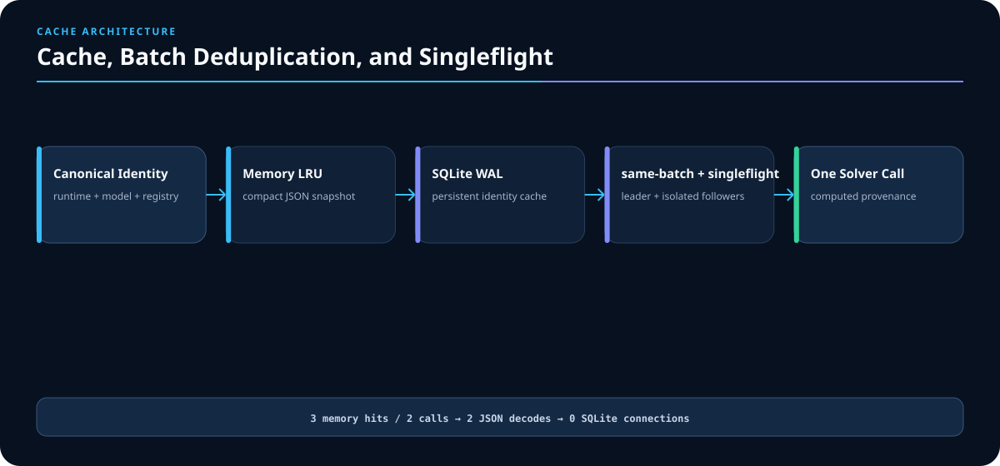
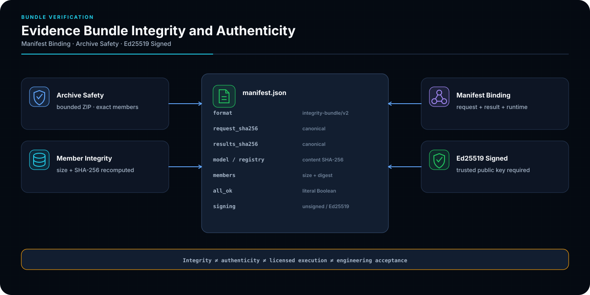
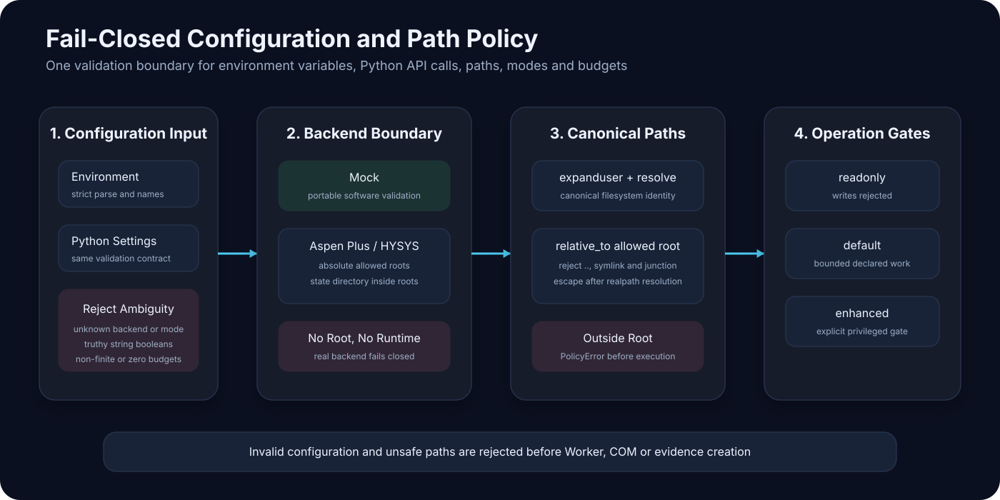
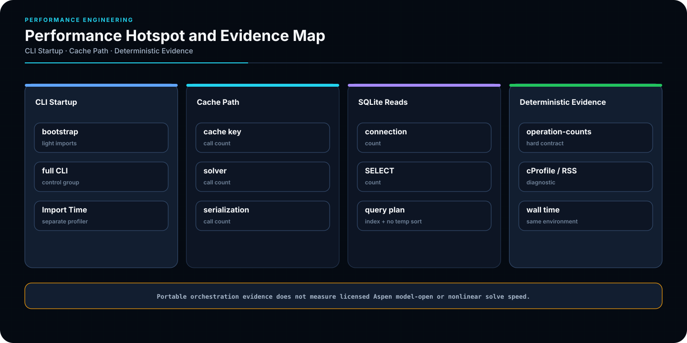

<div align="center">

# AspenOps 2.0

## 面向 Aspen Plus / Aspen HYSYS 与 AI Agent 的确定性工程控制平面

**受控需求 → 强类型流程图 → 可验证编译计划 → 进程隔离执行 → 工程判定 → 可审计证据**

[English](README.en.md) · [Architecture](docs/architecture.md) · [Delivery Acceptance](docs/delivery-acceptance.md) · [Windows Setup](docs/windows-setup.md) · [Certification](docs/certification.md) · [Quality Report](docs/quality-report.md)

[](https://github.com/SUNHAOJUN22/AspenOps-Agent/actions/workflows/ci.yml?query=branch%3Amain+event%3Apush)
[](https://github.com/SUNHAOJUN22/AspenOps-Agent/actions/workflows/windows-control-plane.yml?query=branch%3Amain+event%3Apush)


</div>


> 本 README 使用二十三张受治理的 AspenOps 自包含 SVG，并新增四张 AI 辅助验收示意图。它们只解释仓库中已实现的软件合同或明确标注的 planned 路线；Mock、Fake COM、哈希、签名、公共 CI 与离线编译都不能替代真实商业 Aspen 工程认证。

## 验收结论

| 项目 | 当前结论 |
|---|---|
| 唯一长期分支 | `main` |
| 软件包 | `aspenops-nexus 2.0.0` |
| 公开软件资格基线 | 1224 passed，0 failed，0 errors，95.03% 分支覆盖率 |
| 顺序独立性 | reverse order PASS；seed `20260728` PASS |
| 交付验证器 | `python scripts/verify_delivery.py --output var/ci/delivery-acceptance.json` |
| 真实 Aspen/HYSYS | `PENDING_REAL_ASPEN_CERTIFICATION` |
| 原生任意流程图自动构建 | 未声明为生产能力 |
| 人工工艺、安全、物性与设备验收 | 必须由项目验收方完成 |

机器证据以 `docs/ACCEPTANCE_HARDENING_QUALIFICATION.json` 和永久 GitHub Actions 为准。历史资格只证明对应源码与运行，不自动证明任意后续提交。

## AI 视觉图谱

| 意图与编译 | 执行与数学 | 证据与交付 |
|---|---|---|
|  |  |  |
|  |  |  |
|  |  |  |
|  |  |  |
|  |  |  |
|  |  |  |
|  |  |  |
|  |  |  |
|  |  |  |

---

## 项目定位

AspenOps 不是让大模型生成任意 COM、Python、VBA 或 Shell 的包装器。它把 Agent、CLI、Python、Aspen Plus 与 HYSYS 接入同一受控平面：

```text
Human / Agent
→ ProcessRequirementDocument
→ ProcessDesignIR
→ Engineering Rules
→ Capability Profile
→ Compilation Plan
→ Isolated Worker
→ Solver / Readback
→ Constraints + Balances
→ Evidence Bundle
```

已实现的软件边界：

- 对批准模型执行语义化读写、批处理、缓存、调度、优化和证据归档；
- 每个真实模拟器实例由独立 Windows 子进程、STA apartment 与私有模型副本拥有；
- Agent 只提交语义键和强类型文档，不拥有任意 Tree Path；
- 写入后回读，失败回滚；回滚失败、协议失败、求解后异常或超时会使 Worker tainted 并回收；
- Aspen Plus/HYSYS 14/15 能力配置、离线编译合同和原生适配器一致性门已经实现；
- 真实商业求解器、许可证、Golden Cases、参考值和工程容差仍属于外部资格。

---

## 数学与工程合同


### 1. 动态物料衡算

对组分 \(i\)：

```math
\frac{dN_i}{dt}
=
\sum_{s\in\mathcal I} \dot n_{i,s}
-
\sum_{s\in\mathcal O} \dot n_{i,s}
+
\sum_{r\in\mathcal R} \nu_{i,r} r_r V
```

稳态条件为：

```math
0=
\sum_{s\in\mathcal I} \dot n_{i,s}
-
\sum_{s\in\mathcal O} \dot n_{i,s}
+
\sum_{r\in\mathcal R} \nu_{i,r} r_r V
```

AspenOps 不假定“求解器返回成功”就代表衡算通过。衡算残差单独进入 `balance_residuals`，非有限项触发 `balance_non_finite` 和 `balance_failed`。

### 2. 能量衡算

```math
\frac{dU}{dt}
=
\dot Q-\dot W
+
\sum_{s\in\mathcal I} \dot n_s \hat h_s
-
\sum_{s\in\mathcal O} \dot n_s \hat h_s
```

实际工程中仍需项目方批准焓基准、热损失、轴功、反应热和相平衡模型。

### 3. 约束违反度

对不等式 \(g_j(x)\le 0\) 和等式 \(h_k(x)=0\)：

```math
V(x)
=
\sum_j \max(0,g_j(x)-\varepsilon_j)
+
\sum_k \max(0,|h_k(x)|-\varepsilon_k)
```

通信、引擎、收敛和工程约束相互独立：

```math
OK =
C_{comm}
\land C_{engine}
\land C_{conv}
\land C_{finite}
\land C_{constraint}
\land C_{balance}
```

任何 `NaN`、`Infinity`、文本伪数值或布尔值伪装的数值都会 fail closed。证据写入使用 `allow_nan=False`。

### 4. 单位和物理维度

对仿射单位：

```math
x_t=(x_s+a_s)m_s/m_t-a_t
```

温度必须在绝对温标上满足：

```math
T_K>0
```

参数合同约束数值类型、有限性、物理维度、整数性、分数范围和正值范围。单位缺失只能在明确存在规范单位的兼容路径中解释，错误维度仍阻断。

### 5. 缓存身份

```math
K =
SHA256(
schema
\Vert version
\Vert backend
\Vert runtime
\Vert model
\Vert registry
\Vert request_{physical}
)
```

`metadata` 中的显示标签不改变物理身份；模型、注册表、后端、运行时或验证语义变化会改变缓存键。

### 6. Warm-start 轨迹


```math
x_{k+1}=F(x_k,u_k),\qquad y_k=G(x_k)
```

因此 warm-start 结果依赖顺序。AspenOps 的策略是：

- 同一轨迹必须使用一个 Worker；
- 禁止 persistent cache、same-batch dedup 和 inflight singleflight；
- 显式 session/step 参与轨迹身份；
- 优化必须使用 `reset_mode='reinitialize'`，避免目标函数路径依赖。

### 7. 约束优化

```math
\min_x\;J(x)=\sum_{m=1}^M w_m f_m(x)
```

并满足变量边界、通信、收敛、约束和衡算门。差分进化使用固定种子和有限预算；Pareto 集先精确去重，再应用可行性优先与非支配判定。

### 8. 证据身份与签名

```math
H_{bundle}
=
SHA256(
H_{request}\Vert
H_{results}\Vert
H_{model}\Vert
H_{registry}\Vert
H_{environment}
)
```

Ed25519 签名只能证明受信密钥对规范 manifest 的认证，不能自授真实 Aspen 工程资格。

---

## 原生适配器一致性门


原生执行前必须通过 `aspenops.native-adapter-manifest/v1`：

- profile、profile SHA-256、adapter contract、代码哈希、运行时身份一致；
- 基础编译计划中的 operation 与 `adapter_key` 全覆盖；
- topology readback、layout readback、save/reopen 和 failure isolation 能力存在；
- 授权在执行前及步骤边界保持新鲜；
- manifest 与 conformance report 摘要进入执行记录。

## 原生失败隔离


支持两类可验证策略：

```text
PRIVATE_CASE_DISCARD
step failure → discard_private_case() → discarded=true

TRANSACTIONAL_ROLLBACK
begin_transaction()
→ steps
→ commit_transaction(token)
or rollback_transaction(token)
```

清理接口缺失、返回形状错误或清理本身失败，都会升级为 `NativeBuildError`，不能伪装为普通求解失败。

---

## 快速开始

要求：Python 3.11–3.13，`uv >= 0.11.16`。

```bash
git clone https://github.com/SUNHAOJUN22/AspenOps-Agent.git
cd AspenOps-Agent

uv lock --check
uv sync --frozen --extra dev --extra agent --extra signing

uv run aspenops --version
uv run aspenops demo
uv run aspenops dry-run examples/batch-request.example.json
python scripts/verify_delivery.py --output var/ci/delivery-acceptance.json
```

Windows 真实后端：

```powershell
uv sync --frozen --extra windows --extra dev --extra agent --extra signing
uv run aspenops doctor --probe
```

MCP Wheel 合同：

```text
mcp>=1.9,<2
```

Mock 是控制面测试后端，不代表真实 Aspen Plus/HYSYS 热力学或设备结果。

## 配置边界

```dotenv
ASPENOPS_BACKEND=mock
ASPENOPS_MODE=default
ASPENOPS_ALLOWED_ROOTS=
ASPENOPS_STATE_DIR=var/aspenops-state
ASPENOPS_LICENSE_SLOTS=1
ASPENOPS_MAX_WORKERS=1
ASPENOPS_MAX_RESIDENT_CASES=2
```

真实后端必须提供绝对允许根目录：

```dotenv
ASPENOPS_BACKEND=aspen_plus
ASPENOPS_ALLOWED_ROOTS=C:/AspenModels;C:/AspenResults
ASPENOPS_STATE_DIR=C:/AspenResults/aspenops-state
```

策略：

1. 真实后端不允许空 allowlist。
2. `..`、符号链接、junction 和 realpath 逃逸被拒绝。
3. `license_slots` 与 `max_workers` 共同限制并发。
4. 未知 backend/mode、字符串伪布尔、非有限数和零/负预算在构造期失败。
5. 私钥、Token、许可证秘密、客户模型和生产数据不得提交仓库。

## 配置与路径安全策略


```text
Environment / Python API
→ Type Gate
→ Backend and Mode Allowlist
→ Absolute Root Policy
→ resolve()
→ relative_to(approved root)
→ Operation Gate
```

`readonly`、`default`、`enhanced` 是明确授权模式；未知模式不能继承默认权限。

## 独立有效性门


```text
communication_ok
AND engine_ok
AND converged
AND feasible
AND finite evidence
AND constraints passed
AND balances passed
```

Aspen Plus/HYSYS running flag 只接受明确布尔值、支持的 COM 数值和有限已知字符串，不依赖 `bool("False")`。

## 典型工作流

### 批处理

```bash
uv run aspenops run-batch examples/batch-request.example.json \
  --output var/aspenops-state/results.json \
  --bundle var/aspenops-state/run-bundle.zip
```

### 持久调度

终端 1：

```bash
uv run aspenops scheduler
```

终端 2：

```bash
JOB_ID=$(
  uv run aspenops submit examples/batch-request.example.json |
  python -c 'import json,sys; print(json.load(sys.stdin)["job_id"])'
)
uv run aspenops job "$JOB_ID"
uv run aspenops cancel "$JOB_ID" --grace-s 2
```

提交结果公开 `paths_pinned=true` 与绝对 `submission_cwd`。

### 优化

```bash
uv run aspenops optimize examples/optimization-request.example.json \
  --output var/aspenops-state/optimization-result.json
```

### 证据验证

```bash
uv run aspenops verify-bundle var/aspenops-state/run-bundle.zip
```

### MCP

```bash
uv run aspenops mcp
```

## MCP 兼容性与服务生命周期


```text
FastMCP lifespan enter
→ SDK compatibility gate
→ scheduler.start()
→ 14 constrained tools
→ scheduler.stop()
→ Pool / Worker cleanup
```

MCP 不暴露任意 Shell、COM、Python、VBA 或 Aspen Tree Path。

## 约束优化闭环


使用策略：

- 先用 Mock 验证请求结构、预算和证据；
- 在真实模型上从小种群、低并发开始；
- 所有优化点使用 reinitialize；
- 约束与衡算失败不应通过惩罚系数被“洗白”；
- checkpoint 必须位于 state/allowed roots；
- 真实后端结果保持 `PENDING_REAL_ASPEN_CERTIFICATION`，直至工程人员批准。

## 调度与恢复


```text
pending
→ claimed
→ running
→ completed | failed | cancelling
→ retry_wait | dead_letter | cancelled
```

租约过期且仍有尝试次数进入 `retry_wait`；最终尝试耗尽进入 `dead_letter`。结果提交使用 owner fencing 与幂等 commit token。

## 缓存、批内去重与单航班


- reinitialize 请求可以使用 memory LRU、SQLite WAL、`same_batch_dedup` 与 `inflight_singleflight`；
- warm-start 请求不参与上述复用；
- 失败结果仅在显式策略允许时缓存；
- 缓存读取拒绝非标准 JSON 常量和非对象 payload；
- 返回对象深度隔离，调用方修改不会污染缓存。

## Worker 所有权与回收


一个 Worker 拥有：

- 一个 spawned Python 进程；
- 一个 COM STA；
- 一个模拟器 Automation Server；
- 一个私有模型与 registry 快照；
- 一个顺序命令流；
- 一个 Windows Job Object 或经验证的进程所有权边界。

超时、崩溃、协议错误、tainted transaction、生命周期预算和 post-write exception 都触发回收。

## 性能工程与证据


性能先于宣传、后于正确性。仓库使用：

```text
scripts/measure_cli_startup.py
scripts/measure_operation_counts.py
scripts/measure_job_store_queries.py
```

输出：

```text
cli-startup.json
operation-counts.json
job-store-query-plan.json
```

`Performance Audit V2` 区分确定性 operation-count 合同与环境敏感 wall-time。任何加速比必须绑定同环境、输入、重复次数和统计量。

## 工业应用场景


适用：

- 已批准 Aspen 模型的参数扫描、DOE 与灵敏度分析；
- 批量工况计算、约束筛选和证据归档；
- 有限预算优化与 Pareto 分析；
- 多模型持久调度和许可证席位控制；
- Agent 辅助的需求、IR、规则检查和运行报告。

不适用：

- 无工程输入时自动发明物性方法、反应动力学或设备规格；
- 绕过 Aspen/HYSYS 许可证；
- 自动宣称安全、设计或工艺验收；
- 未验证的任意原生流程图构建。

## 证据包完整性与真实性


ZIP 成员、路径、压缩率、成员数、单成员尺寸和总解压尺寸均受限。manifest 绑定字节长度和 SHA-256；读取和写入使用 JSON-safe 语义。签名真实性、软件完整性、商业求解器运行和人工工程批准是四个独立层级。

## 交付验收


```bash
python scripts/verify_delivery.py --output var/ci/delivery-acceptance.json
uv run ruff check .
uv run ruff format --check .
uv run mypy src
uv run pytest --cov=aspenops_nexus --cov-branch --cov-fail-under=95
uv run python scripts/run_test_order_gate.py --seed 20260728 --output-dir var/ci
uv build
```

交付验证器检查：

- 双语 README、数学合同、二十三张受治理 SVG 与四张新增 AI 验收图；
- 软件资格 JSON 的 schema、测试数、覆盖率和顺序门；
- 四个永久 workflow，且不存在 `once`/`finalizer` 临时编排；
- 软件版本、许可证、外部资格 HOLD 和关键交付文件；
- 禁止在交付声明中伪造真实商业求解器认证。

## 项目结构

```text
src/aspenops_nexus/     控制平面、Worker、Pool、缓存、调度、优化与证据
scripts/                审计、基准、交付验证与可视化工具
tests/                  软件合同、回归、顺序独立性与治理测试
examples/               Mock、批处理、优化和 Process IR 示例
docs/                   架构、资格、性能、认证和验收文档
.github/workflows/      四个永久只读资格工作流
```

## 故障排查

| 现象 | 处理 |
|---|---|
| `doctor --probe` 找不到 Aspen | 检查 Windows、安装位数、ProgID 与许可证，不要用 Mock 结果替代 |
| 路径被拒绝 | 使用绝对允许根目录，检查 symlink/junction/realpath |
| `constraint_non_finite` | 检查求解输出、单位转换和派生计算 |
| `balance_non_finite` | 检查流量、焓、系数和残差归一化 |
| warm-start 被拒绝 | 使用单 Worker；显式 session/step；优化改用 reinitialize |
| Worker 被回收 | 查看 timeout、protocol、tainted、post-write exception 和 runtime identity |
| 证据包验证失败 | 检查成员清单、SHA-256、大小、签名密钥和 `allow_nan=False` |
| 真实资格仍 HOLD | 提供持证求解器、固定输入、硬件指纹、参考值与容差 |

## 许可证与合规

Apache-2.0 仅覆盖本仓库代码。Aspen Plus、Aspen HYSYS、Windows、许可证服务器、客户模型和工艺数据受各自许可与保密条款约束。不得绕过许可证、访问控制或安全审查。

## 外部资格接收清单

真实 Aspen/HYSYS 资格至少需要：

1. 求解器产品、精确版本、位数和 ProgID；
2. 有效许可证特征与允许并发席位；
3. 固定且获批的模型、registry、输入和输出清单；
4. CPU、内存、Windows、Python 和运行器指纹；
5. 每个 Golden Case 的科学/工程参考值；
6. 绝对/相对容差、重复次数和通过规则；
7. topology/layout/save-reopen/readback 证据；
8. 工艺、安全、物性和设备负责人签字。

在这些证据齐全前，状态保持 `PENDING_REAL_ASPEN_CERTIFICATION`。
