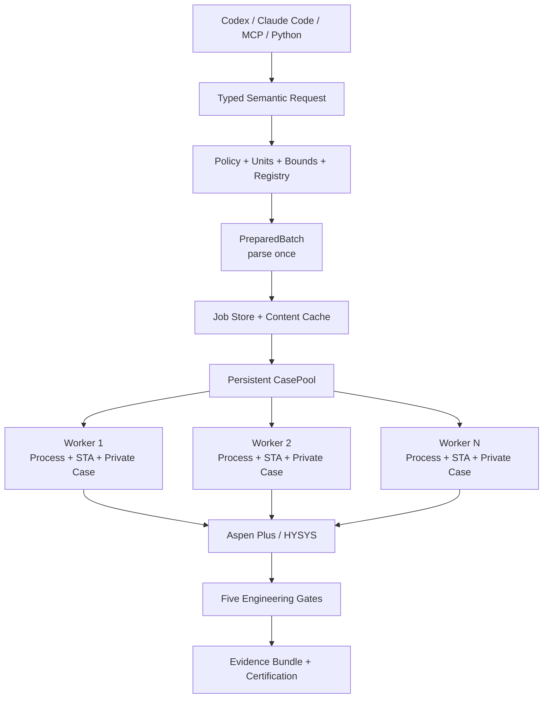
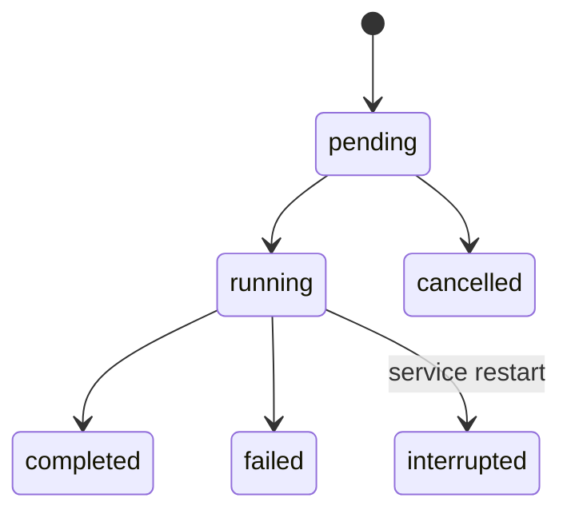
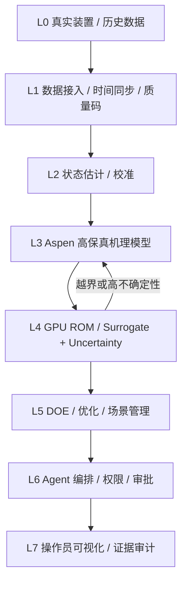

<div align="center">

# AspenOps 1.2

## 为 Aspen 建立一层确定性、高吞吐、可验证、可审计的 Agent 执行控制平面

### Codex / Claude Code / MCP → 语义工艺意图 → 隔离执行 → Aspen 求解 → 工程判定 → 可复现实验证据

**不是 GUI 宏。不是几行 `Tree.FindNode()`。不是让大模型直接触碰任意 COM。**  
**AspenOps 把有状态、会阻塞、版本敏感且受许可证约束的流程模拟器，封装为具有工程语义和证据边界的计算系统。**

[中文](README.md) | [English](README.en.md)

[](https://github.com/SUNHAOJUN22/AspenOps-Agent/actions/workflows/ci.yml)


</div>

---

## 当前资格状态

| 资格层 | 状态 | 已验证内容 |
|---|---:|---|
| Ruff、格式、严格类型 | **PASS** | Ruff 与 32 个源模块 strict mypy 通过 |
| 自动测试 | **PASS** | **78 passed，1 skipped**；跳过项仅为持证 Windows Aspen 集成测试 |
| 覆盖率 | **PASS** | 总覆盖率 **85%**，包含分支覆盖统计 |
| Mock 多进程执行 | **PASS** | 使用真实 `spawn` Worker、IPC、缓存、调度、证据和后台作业代码路径 |
| Fake COM 契约 | **PASS** | 批量写入、回滚、严格布尔、收敛证据、故障注入 |
| Wheel / Sdist / 独立安装 | **PASS** | 全新虚拟环境安装 Wheel 后运行版本、Doctor、Demo 与 Benchmark |
| Windows COM 激活 | **BLOCKED** | 当前构建节点不是安装 Aspen 的 Windows 主机 |
| 真实模型求解 | **BLOCKED** | 未提供许可证席位和批准的非保密资格模型 |
| 真实物理认证 | **BLOCKED** | 尚无三次独立 Aspen 求解、约束和守恒证据 |

> **真实性边界：** Mock 通过不等于 Aspen 通过；COM 可实例化不等于模型可用；`Run2()` 返回不等于收敛；收敛也不自动等于物理可信。

---

## 一句话定义

> **Agent 决定研究什么，Aspen 求解热力学与流程方程，AspenOps 决定操作是否允许、单位是否正确、状态是否收敛、结果是否满足工艺与守恒、证据是否能够复现。**

AspenOps 的核心流水线是：

```text
Typed Request
  → Policy / Units / Bounds / Semantic Registry
  → PreparedBatch / Content Identity / Cache / Job Store
  → Persistent Process-isolated CasePool
  → Aspen Plus or HYSYS Solver
  → Transport / Engine / Convergence / Constraints / Balances
  → Immutable Evidence Bundle
```

Aspen Plus 和 Aspen HYSYS仍然是高保真流程模拟器。AspenOps 不替代热力学与流程求解，而是在 Agent 与求解器之间建立确定性执行边界。

---

## 1.2 为什么是一次执行语义升级

AspenOps 1.2 删除了“表面成功、实际不确定”的逻辑：

- 请求省略 `backend` 时继承部署配置，不再静默落到 Mock；
- 每个批请求只解析、授权和验证一次，不再在 dry-run 与执行之间重复整套工作；
- `"false"`、`0/1` 之外的整数和其他畸形值不能冒充后端布尔状态；
- 后端请求被拒绝与 Worker 传输故障分离，不再进行无意义重启和重试；
- 仅启动缓存未命中且唯一物理工况真正需要的 Worker；
- 大规模 SQLite 缓存查询分块执行，避免参数数量上限；
- 后台作业列表使用一次查询，删除 N+1 读取；
- Engine 未返回时停止读取输出，不制造二次异常掩盖根因；
- 守恒归一化尺度必须严格大于零；
- Worker 协议升级到 3，所有公开 Schema 升级到 v1.2。

### 单点稀疏负载的直接收益

在 `workers=16`、只有 1 个唯一 Mock 工况的同机测试中：

| 版本 | 实际启动 Worker | 总耗时 |
|---|---:|---:|
| 1.1 | 16 | 2.180 s |
| 1.2 | 1 | 0.166 s |

启动实例数减少 **93.75%**，总耗时减少约 **92.4%**。在真实 Aspen 环境中，每个多余 Worker 都可能占用许可证席位、内存和一个模拟器实例，因此这比微小的 Python 算术优化更有工程价值。

---

## 系统架构



### 不可破坏的运行时不变量

```text
一个 Worker
= 一个操作系统子进程
= 一个 COM STA apartment
= 一个私有模型副本
= 一个模拟器文档
= 一条顺序命令流
```

COM Proxy 不通过 Queue、Pipe、线程或 JSON 边界传递。父进程只交换有版本的可序列化消息。

---

## 五重有效性门

一次调用返回控制权，不代表一次有效物理计算。AspenOps 只有在以下五项同时通过时才返回 `ok=true`：

\[
S_{valid}=S_{transport}\land S_{engine}\land S_{convergence}
\land S_{constraints}\land S_{balances}
\]

| 门禁 | 语义 |
|---|---|
| `transport_ok` | IPC 完整、协议版本和 request ID 一致 |
| `engine_ok` | 模拟器调用明确返回，且状态字段类型合法 |
| `convergence_known && converged` | 存在项目认可的明确收敛证据 |
| `constraints_ok` | 产品、设备和操作约束全部通过 |
| `balances_ok` | 配置的物料、能量或元素守恒通过 |

### 守恒残差

\[
r_b=\sum_{i=1}^{m}a_iq_i-q_{expected}
\]

\[
\varepsilon_{abs}=|r_b|,
\qquad
\varepsilon_{rel}=\frac{|r_b|}{\max(\sum_i|a_iq_i|,q_{floor})}
\]

通过条件：

\[
\varepsilon_{abs}\le\tau_{abs}
\quad\lor\quad
\varepsilon_{rel}\le\tau_{rel}
\]

证据中保存每个项的系数、单位、值、带符号贡献、尺度、残差和容差，而不是只保存一个布尔值。

---

## Aspen 版本适配：发现本机事实，不猜营销版本

AspenOps 不维护容易过时的“V14/V15/V16 对照表”。Windows Worker 启动时：

1. 优先使用显式 `ASPENOPS_PROGID` / `ASPENOPS_HYSYS_PROGID`；
2. 扫描 64 位与 32 位 Registry View；
3. 枚举 `Apwn.Document.*` 与 `HYSYS.Application.*`；
4. 按数字版本降序尝试；
5. 使用 `DispatchEx` 创建隔离实例；
6. 最后使用无版本 ProgID 回退；
7. 把实际成功 ProgID、应用暴露版本和运行能力写入证据与缓存身份。

兼容性必须逐层报告：

```text
Discovered → Instantiated → Model opened → Converged → Physically certified
```

前一层永远不能冒充后一层。

---

## Aspen Plus 与 HYSYS 的安全调用模型

### Aspen Plus

- 私有复制 `.bkp` / `.apw` / `.apwz`；
- 解析并缓存已验证的 Tree Node；
- 写前读取原值，写后回读；
- 批写中途失败时逆序回滚；
- 收集项目配置的状态节点和 Engine 消息；
- 正负证据冲突时失败关闭；
- `Engine.Running == False` 只表示停止运行，不表示收敛。

### Aspen HYSYS

默认采用工程师拥有的 Spreadsheet Contract：

```text
Semantic Key → Registry → Spreadsheet + Cell → HYSYS internal binding
```

HYSYS Solver 进入空闲状态不被解释为通用收敛。生产请求必须提供项目验证过的 Spreadsheet 收敛信号；没有该信号，dry-run 直接拒绝。

---

## 高性能执行模型

逐点启动：

\[
T_{naive}\approx N(T_{start}+T_{open}+T_{write}+T_{solve}+T_{read})
\]

持久 CasePool：

\[
T_{pool}\approx W(T_{start}+T_{open})+
\frac{N_{unique}}{W}(T_{write}+T_{solve}+T_{read})+T_{IPC}
\]

有效并发：

\[
W_{effective}=\min(W_{configured},W_{license},W_{memory},W_{stable},N_{miss})
\]

1.2 的性能策略：

- Worker 懒启动，缓存全命中时不额外消耗许可证；
- Worker 数受唯一未命中工况数约束；
- 一个物理工况只进行一次主要 IPC；
- 动态领取任务，避免固定分块长尾；
- 重复物理点执行一次，结果不可变扇出；
- Tree/Spreadsheet 解析结果缓存；
- 内容寻址缓存绑定运行时、实际 ProgID、模型、注册表和求解配置；
- Worker 按任务数、年龄、进程状态回收；
- 只有幂等的 reinitialize 传输失败可以有限重试；
- warm-start 是一条有序状态轨迹，不缓存、不去重、不跨 Worker、不静默重试。

### 同机 Mock 控制平面对照基准

48 个唯一工况，每种 Worker 配置 5 轮：

| Worker | 1.1 throughput | 1.2 throughput | 变化 |
|---:|---:|---:|---:|
| 1 | 32.58 points/s | 33.08 points/s | +1.53% |
| 2 | 51.49 points/s | 50.73 points/s | -1.48% |
| 4 | 55.54 points/s | 54.20 points/s | -2.41% |

常规饱和批次的差异处于小幅波动范围：1 Worker 略有提升，2/4 Worker 略有回退。因此 1.2 不宣称普遍吞吐加速；其确定性收益是减少无用实例、避免错误重试和降低许可证占用。

这组数字证明控制平面的调度、IPC 与缓存行为，**不代表真实 Aspen Solver 或 CUDA 被加速**。真实最优 Worker 数必须在目标模型、许可证和内存约束下重新测量。

---

## 内容寻址缓存

\[
K=H(V_{runtime},P_{protocol},B,P_{COM},H(M),H(R),H(C),Q_{physical})
\]

缓存身份包含 AspenOps Schema、Worker 协议、后端、实际 COM ProgID、模型 SHA-256、语义注册表 SHA-256、求解器和收敛配置以及真实物理输入。实验名称、提交时间和 `point_index` 不进入物理身份。失败结果默认不长期缓存。

---

## 后台作业



SQLite WAL 保存请求、状态、时间、结果、证据路径和错误。服务重启时遗留的 `running` 不伪装成成功，而是标记为 `interrupted`。

---

## NVIDIA 风格的分层数字孪生

AspenOps 借鉴 NVIDIA Physical AI 与数字孪生体系中的**分层、可观测、可回退和证据化**思想，但不堆砌无收益基础设施：



明确边界：

- Aspen 是高保真热力学与流程方程求解器；
- NVIDIA GPU 适合代理模型、ROM、贝叶斯优化、不确定性传播和结果分析；
- 不宣称 CUDA 可以直接加速 Aspen COM `Run2()`；
- 代理模型必须记录训练数据、版本、适用域和不确定性；
- 超出适用域时回退 Aspen；
- 默认采用 shadow mode，未经批准不闭环写入生产装置；
- Omniverse 只能是可选 USD 可视化 Adapter，不是热力学求解器，也不是 Core 强依赖。

---

## 安装

### 跨平台开发与 Mock

```bash
uv sync --extra dev --extra agent --extra report
uv run aspenops version
uv run aspenops doctor
uv run aspenops demo
```

### Windows Aspen 工作站

```powershell
uv sync --extra windows --extra agent --extra dev --extra report
$env:ASPENOPS_BACKEND = "aspen_plus"
$env:ASPENOPS_ALLOWED_ROOTS = "D:/AspenModels;D:/AspenResults"
$env:ASPENOPS_LICENSE_SLOTS = "1"
uv run aspenops doctor --probe
```

不要把许可证、客户模型、私有动力学、凭据或真实运行数据提交到 GitHub。

---

## 请求示例

```json
{
  "backend": "aspen_plus",
  "model_path": "D:/AspenModels/column.bkp",
  "registry_path": "D:/AspenModels/column.registry.json",
  "workers": 2,
  "base_writes": [
    {
      "key": "stream.input.temperature",
      "identifiers": {"stream": "FEED"},
      "value": 95.0,
      "unit": "C"
    }
  ],
  "points": [
    {"writes": [{"key": "block.input.reflux_ratio", "identifiers": {"block": "COL1"}, "value": 1.8, "unit": "1"}]},
    {"writes": [{"key": "block.input.reflux_ratio", "identifiers": {"block": "COL1"}, "value": 2.0, "unit": "1"}]}
  ],
  "reads": [
    {"key": "stream.output.purity", "identifiers": {"stream": "PRODUCT"}, "unit": "fraction"}
  ]
}
```

```bash
uv run aspenops dry-run request.json
uv run aspenops run request.json
uv run aspenops submit request.json
uv run aspenops job <job-id>
```

---

## Codex、Claude Code 与 MCP

仓库包含 `.codex/config.toml`、`.mcp.json`、`AGENTS.md` 和 `CLAUDE.md`。

推荐操作顺序：

```text
system_info
→ list_semantic_variables
→ dry_run_request
→ submit_batch / run_batch_sync
→ job_status
→ job_result
→ verify_evidence_bundle
```

十个窄 MCP 工具：

1. `system_info`
2. `list_semantic_variables`
3. `dry_run_request`
4. `run_batch_sync`
5. `submit_batch`
6. `job_status`
7. `job_result`
8. `list_recent_jobs`
9. `cancel_job`
10. `verify_evidence_bundle`

不存在任意 Shell、任意 Python、VBA、通用 COM 反射、无限制 Tree Path 写入或全机进程清理工具。

---

## 测试与发布门

```bash
uv run ruff check .
uv run ruff format --check .
uv run mypy src
uv run pytest -W error::ResourceWarning \
  --cov=aspenops --cov-branch --cov-fail-under=85
uv run python scripts/check_release_consistency.py
uv run python scripts/check_mcp.py
uv build --clear
uv run python scripts/release_gate.py
```

真实 Aspen 资格门位于 `.github/workflows/windows-aspen-certification.yml` 和 `scripts/run_real_certification.ps1`。资格报告必须记录实际 ProgID、Aspen 暴露版本、模型和注册表 SHA-256、三次独立 fresh-instance 结果、收敛、约束和守恒。

---

## 已知边界

- 公开 CI 没有 Aspen 软件和许可证，因此只能验证控制平面；
- Registry 发现不能替代某个具体 Aspen Release 的资格认证；
- 语义路径必须针对真实模型验证；
- HYSYS 需要显式 Spreadsheet 收敛契约；
- warm-start 是路径相关实验，不保证可并行；
- Mock 性能不能用于采购 Aspen 许可证或规划生产吞吐量；
- Omniverse、GPU ROM 和云编排是可选扩展，不属于 Aspen Core 求解认证。

---

## 安全

- 只允许配置根目录下的模型和注册表；
- Agent 默认只能访问语义 Key；
- 单位、边界、读写权限和 identifiers 在 COM 前验证；
- 主模型只读，Worker 使用私有副本；
- 超时只清理当前 Worker 的后代进程；
- 证据绑定请求、模型、注册表、运行时和结果哈希；
- 私有模型、许可证和客户数据由 `.gitignore` 和流程规则排除。

详见 [SECURITY.md](SECURITY.md)、[架构](docs/architecture.md)、[性能](docs/performance.md)、[认证](docs/certification.md) 和 [Windows 安装](docs/windows-setup.md)。

---

## 许可证与引用

Apache-2.0。引用信息见 [CITATION.cff](CITATION.cff)。Aspen Plus、Aspen HYSYS、NVIDIA 和 Omniverse 是其各自权利人的商标；本项目不包含供应商软件、许可证或专有模型。
